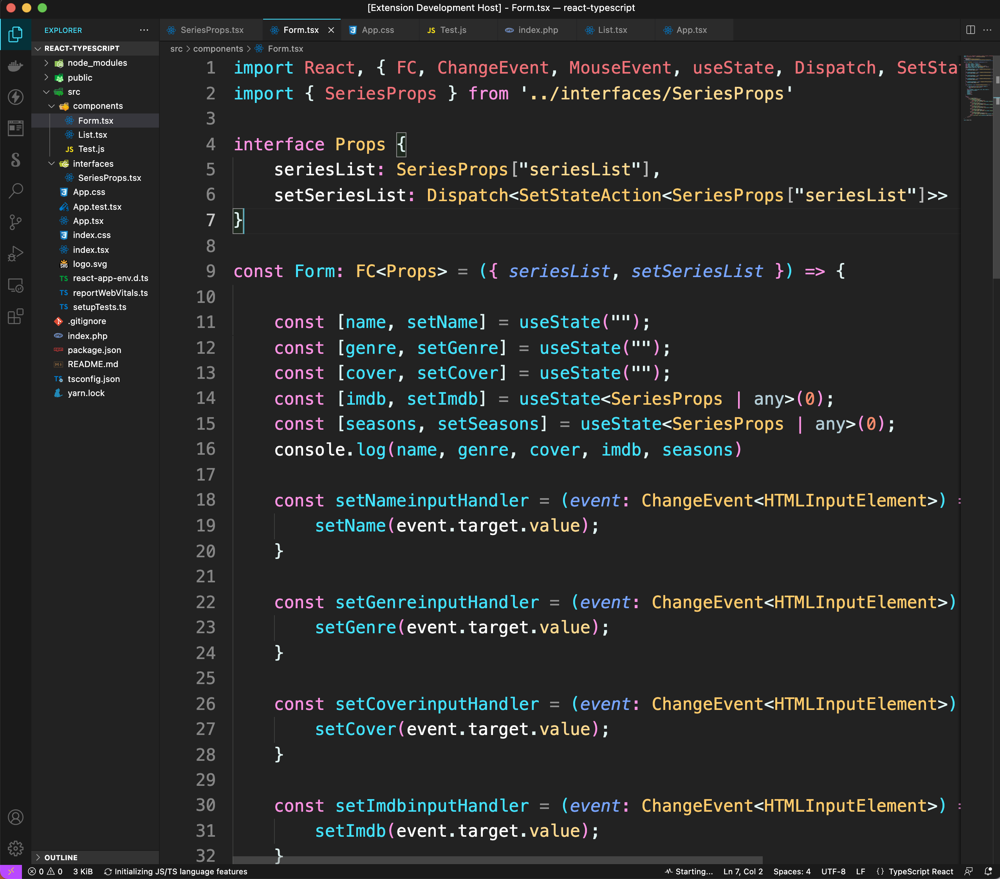
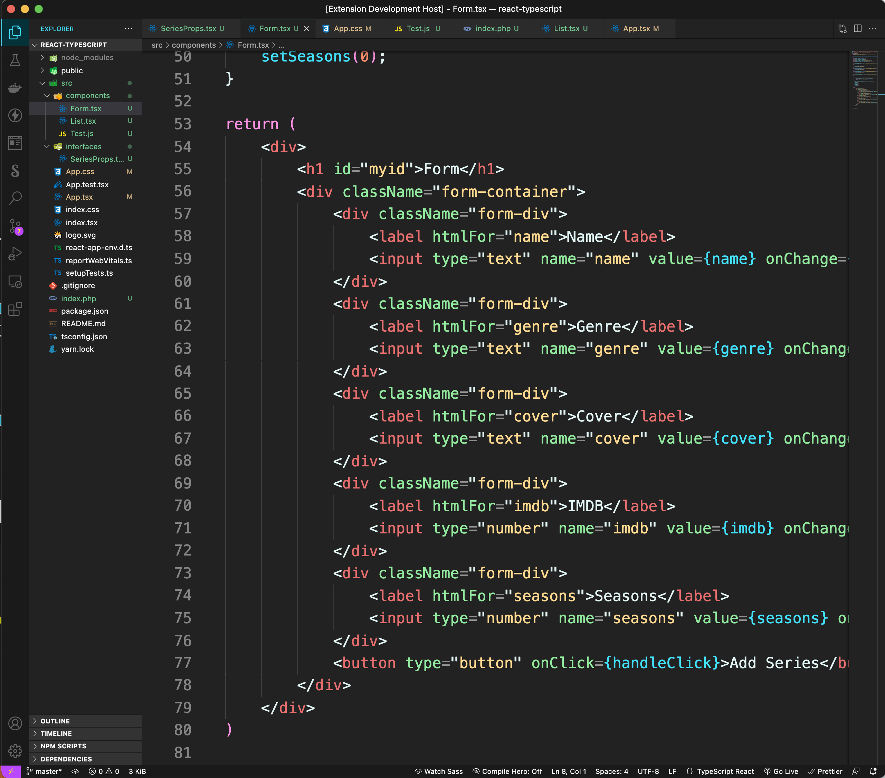
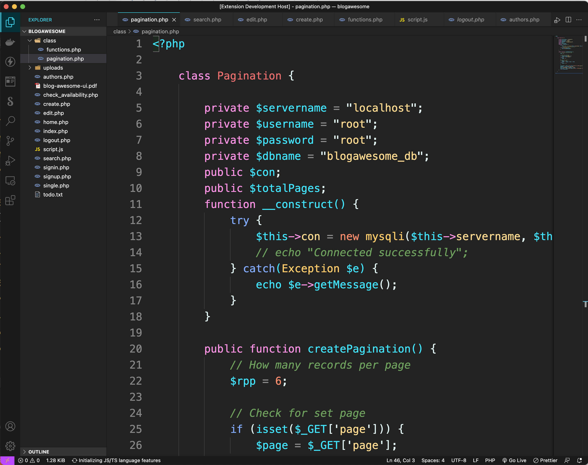

# Milerdark VScode Theme
## comfortable, easy on the eyes

# Installation
---
1. Open the Extensions sidebar in VS Code. View → Extensions
2. Search for milerdark, choose "milerdark" by milerdev
3. Click Install to install it
4. Navigate to File > Preferences > Color Theme > milerdark

--
# Developed by Patiphan Phengpao (Miler)

# 💻 [Youtube Channel](https://www.youtube.com/c/PatiphanPhengpao)
# 👓 [Website](https://patiphannn.com/)
# 👍 [Fanpage](https://facebook.com/patiphannn)
# ☕️ [Buy me a coffee](https://www.buymeacoffee.com/milerdev)