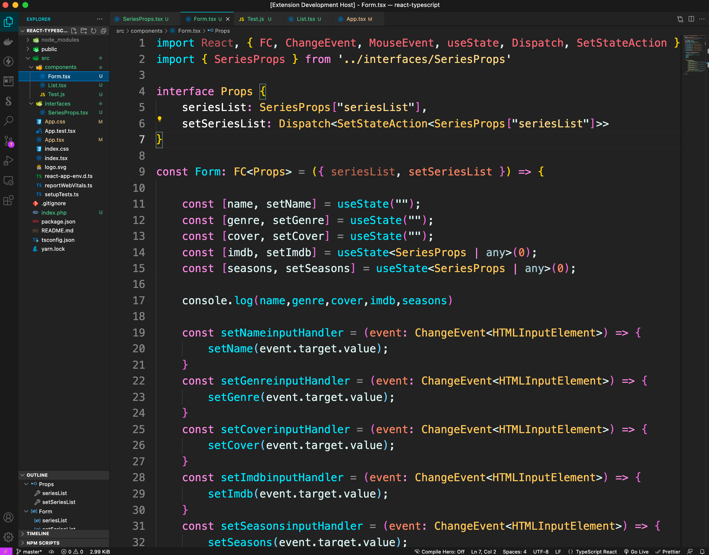

# Milerdark VScode Theme
## comfortable, easy on the eyes

Installation
---
1. Open the Extensions sidebar in VS Code. View → Extensions
2. Search for milerdark, choose "milerdark" by milerdev
3. Click Install to install it
4. Navigate to File > Preferences > Color Theme > milerdark
